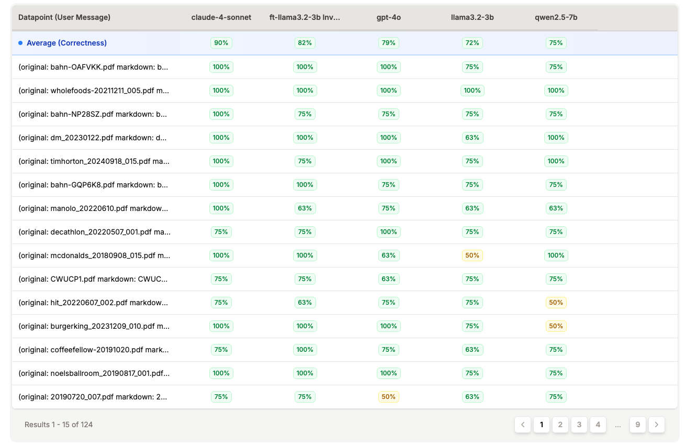

# Invoice Data Extractor

A comprehensive pipeline for creating specialized AI models to extract structured data from invoices and receipts using [Prem Studio](https://www.premai.io/studio) - an end-to-end platform for building custom Language Models.

## Project Overview

This project demonstrates the complete workflow of creating a custom small language model for invoice data extraction, showcasing the capabilities of Prem Studio's no-code AI fine-tuning platform. Instead of relying on expensive general-purpose models like Claude or GPT-4, we create a specialized, cost-effective model that excels at extracting specific information from invoices and receipts.

### What We Extract
- **DateTime**: Transaction date and time
- **Total Amount**: Final transaction amount
- **Currency**: Currency code (USD, EUR, CAD, etc.)
- **Business Name**: Name of the merchant/business
- **Business Location**: City, state/province, country

## Project Architecture

```
Invoice PDFs → Markdown Conversion → Dataset Creation → Model Fine-tuning → Deployment
     (1)              (2)                  (3)                (4)              (5)
```

## Project Structure

```
InvoiceDataExtractor/
├── dataset/
│   ├── originalData/         # Raw PDF invoices and receipts
│   └── mdData/               # Converted markdown files
├── pdfToMd/
│   └── main.py              # PDF to Markdown converter
├── createJsonlDataset/
│   ├── index.ts             # Dataset generator script
│   ├── invoiceDataset.jsonl # Generated training dataset
│   └── package.json         # Dependencies
└── README.md
```

## Getting Started

### Prerequisites

- Python 3.8+ (for PDF conversion)
- Bun (for dataset generation)
- [Prem Studio account](https://www.premai.io/studio) (for model fine-tuning)

### Installation

1. **Clone the repository**
   ```bash
   git clone https://github.com/yourusername/InvoiceDataExtractor.git
   cd InvoiceDataExtractor
   ```

2. **Install Python dependencies**
   ```bash
   cd pdfToMd
   pip install markitdown pathlib
   ```

3. **Install Node.js dependencies**
   ```bash
   cd createJsonlDataset
   bun install
   ```

4. **Set up Prem AI API Key**
   ```bash
   export PREMAI_API_KEY="your-premai-api-key"
   ```

## Step-by-Step Pipeline

### Step 1: PDF to Markdown Conversion

Convert raw PDF invoices to clean, structured markdown format using the `pdfToMd/main.py` script.

```bash
cd pdfToMd
python main.py
```

**What it does:**
- Processes PDF files from `dataset/originalData/`
- Converts each PDF to markdown using MarkItDown
- Sanitizes text to remove problematic Unicode characters
- Saves clean markdown files to `dataset/mdData/`

**Key Features:**
- Handles multilingual invoices
- Removes control characters that could break JSON processing
- Preserves important formatting and structure

### Step 2: Dataset Creation

Generate a conversational training dataset in JSONL format using the `createJsonlDataset/index.ts` script.

```bash
cd createJsonlDataset
bun run start
```

**What it does:**
- Reads all markdown files from `dataset/mdData/`
- Uses Claude-4-Sonnet via Prem AI to extract structured data
- Creates conversation pairs (user input → assistant response)
- Saves training data in JSONL format for fine-tuning

**Output Format:**
Each line in `invoiceDataset.jsonl` contains a conversation:
```json
{
  "messages": [
    {
      "role": "system",
      "content": "You are a helpful assistant that can extract information from invoices..."
    },
    {
      "role": "user", 
      "content": "(original: invoice.pdf markdown: invoice.md) [markdown content]"
    },
    {
      "role": "assistant",
      "content": "{\"datetime\": \"2024-01-01 12:00:00\", \"total_amount\": 25.99, \"currency\": \"USD\", \"business_name\": \"Coffee Shop\", \"business_location\": \"New York, NY, USA\"}"
    }
  ]
}
```

### Step 3: Model Fine-tuning with Prem Studio

Upload your `invoiceDataset.jsonl` to [Prem Studio](https://www.premai.io/studio), select a base model, and start training. The platform automatically handles hyperparameter optimization and provides real-time training metrics.

### Step 4: Deployment

Your fine-tuned model is automatically deployed to secure endpoints with instant SDK access.

## Model Evaluation Results

After fine-tuning, we evaluated our custom model against base models and closed-source alternatives. The results show that our specialized invoice extraction model performs competitively with larger general-purpose models:



**Key Findings:**
- **Claude-4-Sonnet**: 90% average correctness (baseline)
- **Fine-tuned Llama 3.2-3B**: 82% average correctness
- **GPT-4o**: 79% average correctness
- **Base Llama 3.2-3B**: 72% average correctness
- **Qwen 2.5-7B**: 75% average correctness

The fine-tuned model demonstrates significant improvement over its base version and competitive performance with larger models, while being much more cost-effective and faster for deployment.

## Use Cases

This pipeline can be adapted for various document extraction tasks:

- **Financial Services**: Process expense reports, bank statements
- **Healthcare**: Extract data from medical bills, insurance claims
- **Legal**: Parse contracts, billing statements
- **Retail**: Process purchase orders, delivery receipts
- **Travel**: Extract booking confirmations, travel expenses

---

**Built to showcase the power of specialized AI models created with Prem Studio**
